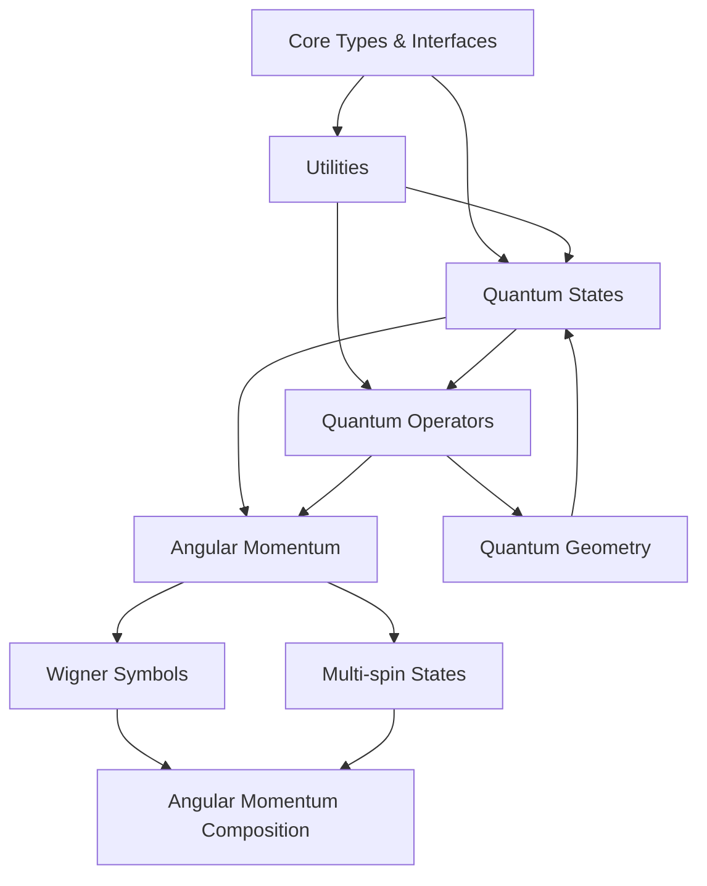

*Last Updated: May 29, 2025*

# Table of Contents

> Recent Updates:
> - Added Wigner Symbols module (T55c)
> - Added Quantum Geometry module
> - Added Multi-spin state handling
> - Added Angular Momentum composition

1. [Overview](#overview)
2. [Core Types and Interfaces](#level-0-core-types-and-interfaces)
3. [Utilities and Basic Operations](#level-1-utilities-and-basic-operations)
4. [Quantum States](#level-2-quantum-states)
5. [Quantum Operators](#level-3-quantum-operators)
6. [Angular Momentum](#level-4-angular-momentum)
   - [Core Operations](#core-angularmomentumcorets)
   - [Wigner Symbols](#wignersymbols-angularmomentumwignersymbolsts)
   - [Composition](#composition-angularmomentumcompositionts)
   - [Multi-spin States](#multispinstate-angularmomentummultispinstatets)
7. [Quantum Geometry](#level-5-quantum-geometry)
   - [Distance Metrics](#quantumdistance-geometryquantumdistancets)
8. [Quantum Circuits](#quantum-circuits-planned)
9. [Dependency Graph](#dependency-graph)
10. [API Status and Stability](#api-status-and-stability)
11. [Performance Considerations](#performance-considerations)
12. [Testing and Validation](#testing-and-validation)
13. [NPM Package](#npm-package)

## Overview
This index provides a hierarchical view of the quantum package components, ordered by their dependencies. Components at each level may depend on components from previous levels but not on components from later levels.

The package implements a comprehensive quantum mechanics library in TypeScript, providing tools for quantum state manipulation, operator algebra, measurements, time evolution, and angular momentum calculations.

## Level 0: Core Types and Interfaces
Location: `src/core/`

### types (`core/types.ts`)

**Interfaces:**
- `IStateVector`
- `IOperator`
- `IMeasurementOutcome`
- `IDensityMatrix`
- `IQuantumChannel`

**Functions:**
- `toComplex`
- `ensureComplex`

**Types:**
- `OperatorType`

### hilbertSpace (`core/hilbertSpace.ts`)

**Classes:**
- `HilbertSpace`

## Level 1: Utilities and Basic Operations
Location: `src/utils/`

### validation (`utils/validation.ts`)

**Functions:**
- `validatePosDim`
- `validateIdx`
- `validateAmps`
- `validateNorm`
- `validateMatchDims`
- `validatePartialTrace`
- `validateMatDims`

### oscillator (`utils/oscillator.ts`)

**Functions:**
- `creationOp`
- `destructionOp`
- `numberOp`
- `positionOp`
- `momentumOp`
- `harmonicOscillator`

### matrixOperations (`utils/matrixOperations.ts`)

**Interfaces:**
- `IMatrixDimensions`
- `IValidationResult`

**Functions:**
- `multiplyMatrices`
- `adjoint`
- `transpose`
- `matrixExponential`
- `tensorProduct`
- `eigenDecomposition`
- `eigenDecomposition`
- `eigenDecomposition`
- `eigenDecomposition`
- `zeroMatrix`
- `addMatrices`
- `normalizeMatrix`
- `scaleMatrix`
- `isHermitian`
- `isUnitary`

**Types:**
- `ComplexMatrix`

### matrixFunctions (`utils/matrixFunctions.ts`)

**Functions:**
- `matrixFunction`
- `matrixLogarithm`
- `matrixSquareRoot`
- `matrixPower`
- `matrixSin`
- `matrixCos`

### math (`utils/math.ts`)

**Functions:**
- `matrixExponential`
- `multiplyMatrices`
- `singularValueDecomposition`

### information (`utils/information.ts`)

**Functions:**
- `schmidtDecomposition`
- `traceDistance`
- `fidelity`
- `traceFidelity`
- `quantumRelativeEntropy`
- `vonNeumannEntropy`
- `entanglementEntropy`
- `linearEntropy`
- `quantumMutualInformation`
- `concurrence`
- `negativity`
- `quantumDiscord`

## Level 2: Quantum States
Location: `src/states/`

### states (`states/states.ts`)

**Functions:**
- `computationalBasis`
- `createBasisState`
- `createBellState`
- `createGHZState`
- `createWState`
- `createPlusState`
- `createMinusState`

### stateVector (`states/stateVector.ts`)

**Classes:**
- `StateVector`

### densityMatrix (`states/densityMatrix.ts`)

**Classes:**
- `DensityMatrixOperator`
- `KrausChannel`

**Functions:**
- `createDepolarizingChannel`
- `createAmplitudeDampingChannel`
- `createPhaseDampingChannel`
- `createBitFlipChannel`
- `createPhaseFlipChannel`

### composite (`states/composite.ts`)

**Functions:**
- `composeSpaces`
- `composeStates`
- `composeOperators`
- `bipartiteSplit`
- `partialTrace`

## Level 3: Quantum Operators
Location: `src/operators/`

### operator (`operators/operator.ts`)

**Classes:**
- `MatrixOperator`

**Functions:**
- `createZeroMatrix`

### measurement (`operators/measurement.ts`)

**Classes:**
- `ProjectionOperator`

**Functions:**
- `expectationValue`
- `measureState`
- `createMeasurementOperator`

### hamiltonian (`operators/hamiltonian.ts`)

**Interfaces:**
- `IHamiltonianTerm`

**Classes:**
- `Hamiltonian`

**Types:**
- `HamiltonianType`

### gates (`operators/gates.ts`)

**Constants:**
- `PauliX`
- `PauliY`
- `PauliZ`
- `Hadamard`
- `CNOT`

### algebra (`operators/algebra.ts`)

**Functions:**
- `addOperators`
- `subtractOperators`
- `commutator`
- `antiCommutator`
- `nestedCommutator`
- `lieDerivative`
- `BCHFormula`
- `operatorsCommute`
- `commutatorExpectation`
- `uncertaintyProduct`
- `isNormalOperator`
- `operatorFromGenerator`
- `createNestedCommutator`
- `projectionOperator`

## Level 4: Angular Momentum
Location: `src/angularMomentum/`

### core (`angularMomentum/core.ts`)
Core angular momentum operations and state management.

**Functions:**
- `createJmState`
- `computationalToAngularBasis`
- `angularToComputationalBasis`
- `identifyBasis`
- `createJplus`
- `createJminus`
- `createJz`
- `createJx`
- `createJy`
- `createJ2`
- `createJ2FromComponents`
- `validateJ`
- `getValidM`
- `isValidM`
- `createRotationOperator`
- `jmExpectationValue`
- `createCoherentState`

### wignerSymbols (`angularMomentum/wignerSymbols.ts`)
Wigner 3j, 6j, and 9j symbol calculations.

**Functions:**
- `wigner3j` - Calculate Wigner 3j symbols
- `validate3jTriangles` - Triangle inequality validation for 3j
- `wigner6j` - Calculate Wigner 6j symbols (in progress)
- `validate6jTriangles` - Triangle inequality validation for 6j
- `cgCoefficient` - Clebsch-Gordan coefficient calculation

### composition (`angularMomentum/composition.ts`)
Angular momentum composition and coupling.

**Functions:**
- `coupleSpins` - Couple multiple spin states
- `uncoupleSpins` - Decompose coupled states
- `computeCGSeries` - Compute CG decomposition series

### multiSpinState (`angularMomentum/multiSpinState.ts`)
Multi-spin state management.

**Classes:**
- `MultiSpinState` - Handle multiple coupled spins

**Functions:**
- `createMultiSpinState` - Create multi-spin states
- `decomposeState` - Decompose into individual spins

## Level 5: Quantum Geometry
Location: `src/geometry/`

### quantumDistance (`geometry/quantumDistance.ts`)
Quantum geometric calculations and metrics.

**Functions:**
- `fidelity` - Calculate quantum state fidelity
- `traceDistance` - Calculate trace distance between states
- `buresDistance` - Calculate Bures distance
- `quantumAngle` - Calculate quantum angle between states
- `fisherInformation` - Calculate quantum Fisher information
- `relativeEntropy` - Calculate quantum relative entropy

## Dependency Graph

## Usage Example Dependencies
*This section needs to be filled with appropriate content.*

## API Status and Stability

### Stable APIs (Production Ready)
- Core Types and Interfaces
- Utilities and Basic Operations
- Quantum States
- Basic Quantum Operators
- Angular Momentum Core

### Beta APIs (Testing)
- Wigner 3j Symbols
- Quantum Geometry
- Multi-spin State Management

### Alpha APIs (In Development)
- Wigner 6j and 9j Symbols
- Angular Momentum Composition
- Quantum Circuit Module (Planned)

### Breaking Changes
- Complex number handling migrated to math.js (T59, T60)
- StateVector interface updated to support properties
- Angular momentum operator creation functions standardized

## Performance Considerations
*This section needs to be filled with appropriate content.*

## Implementation Index
*This section needs to be filled with appropriate content.*

## Error Handling
*This section needs to be filled with appropriate content.*

## Testing and Validation
*This section needs to be filled with appropriate content.*

## NPM Package
*This section needs to be filled with appropriate content.*
