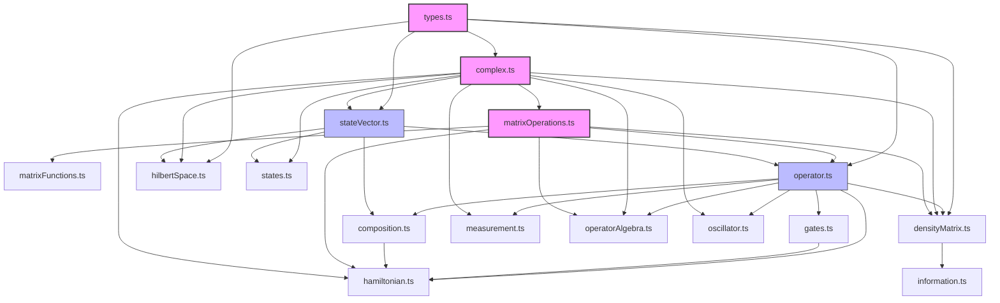

# Quantum Package Architecture

*Last Updated: May 24, 2025*

## Table of Contents

1. [Status Legend](#status-legend)
2. [Overview and Purpose](#1-overview-and-purpose)
3. [System Architecture](#2-system-architecture)
   - 3.1 [Package Structure](#21-package-structure)
   - 3.2 [Dependency Flow](#22-dependency-flow)
   - 3.3 [Design Principles](#23-design-principles)
4. [Module Dependency Map](#3-module-dependency-map)
   - 4.1 [Hierarchical Organization](#31-hierarchical-organization)
5. [Core Components](#4-core-components)
   - 5.1 [Level 0: Core Types and Interfaces](#41-level-0-core-types-and-interfaces)
   - 5.2 [Level 1: Utilities and Basic Operations](#42-level-1-utilities-and-basic-operations)
   - 5.3 [Level 2: Quantum States](#43-level-2-quantum-states)
   - 5.4 [Level 3: Quantum Operators](#44-level-3-quantum-operators)
   - 5.5 [Level 4: Angular Momentum](#45-level-4-angular-momentum)
6. [Mathematical Foundation](#5-mathematical-foundation)
   - 6.1 [Complex Number Operations](#51-complex-number-operations)
   - 6.2 [Matrix Operations](#52-matrix-operations)
   - 6.3 [Quantum State Mathematics](#53-quantum-state-mathematics)
   - 6.4 [Operator Theory](#54-operator-theory)
7. [Integration Patterns](#6-integration-patterns)
   - 7.1 [Graph-Quantum Integration](#61-graph-quantum-integration)
   - 7.2 [Tensor Network Compatibility](#62-tensor-network-compatibility)
   - 7.3 [API Design Patterns](#63-api-design-patterns)
   - 7.4 [Extension Integration](#64-extension-integration)
8. [Performance and Design Considerations](#7-performance-and-design-considerations)
   - 8.1 [Computational Performance](#71-computational-performance)
   - 8.2 [Numerical Stability](#72-numerical-stability)
   - 8.3 [Design Patterns](#73-design-patterns)
   - 8.4 [Scalability Considerations](#74-scalability-considerations)
9. [Extension Points](#8-extension-points)
   - 9.1 [Quantum Circuit Integration](#81-quantum-circuit-integration)
   - 9.2 [Algorithm Support Infrastructure](#82-algorithm-support-infrastructure)
   - 9.3 [Custom Operator Implementation](#83-custom-operator-implementation)
   - 9.4 [Testing and Validation Framework](#84-testing-and-validation-framework)
10. [Migration and Compatibility](#9-migration-and-compatibility)
    - 10.1 [Package Migration Strategy](#91-package-migration-strategy)
    - 10.2 [Build and Configuration](#92-build-and-configuration)
    - 10.3 [Version Management](#93-version-management)
11. [Implementation Roadmap](#10-implementation-roadmap)
    - 11.1 [Migration Phase (From lib/quantum)](#101-migration-phase-from-libquantum)
    - 11.2 [Enhancement Phase (New Features)](#102-enhancement-phase-new-features)
    - 11.3 [Integration Phase (Graph and Tensor Networks)](#103-integration-phase-graph-and-tensor-networks)
    - 11.4 [Implementation Timeline](#104-implementation-timeline)
    - 11.5 [Success Criteria](#105-success-criteria)

## Status Legend
- ✅ **Implemented** - Currently available in packages/quantum
- 🔄 **Migrating** - Exists in lib/quantum, needs migration to packages/quantum  
- 📋 **Planned** - Documented concept, not yet implemented

## 1. Overview and Purpose

The quantum package provides a comprehensive quantum mechanics library implemented in TypeScript, designed specifically for integration with spin network applications and quantum geometric computations. The package serves as the foundational mathematical layer for quantum state manipulation, operator algebra, and quantum information processing.

**Key Objectives:**
- Provide robust quantum state vector operations with arbitrary dimensional support
- Implement comprehensive operator algebra including measurements, time evolution, and angular momentum
- Support advanced quantum information concepts including mixed states and quantum channels
- Enable integration with graph-based quantum systems and tensor networks
- Maintain numerical stability and performance for large-scale quantum computations

**Scope:**
The package focuses on core quantum mechanics primitives while providing extension points for specialized applications such as quantum circuits, spin networks, and quantum algorithms. It serves as a dependency for higher-level packages including graph-core and spin-network modules.

## 2. System Architecture

The quantum package follows a hierarchical architecture with clear dependency layers and separation of concerns. The design emphasizes both functional purity for mathematical operations and stateful patterns where caching and performance optimization are critical.

### 2.1 Package Structure

```
packages/quantum/
├── src/
│   ├── core/           # Core types and interfaces (Level 0)
│   ├── utils/          # Mathematical utilities (Level 1)
│   ├── states/         # Quantum state implementations (Level 2)
│   ├── operators/      # Quantum operators (Level 3)
│   ├── angularMomentum/ # Angular momentum specialization (Level 4)
│   └── index.ts        # Public API exports
├── docs/               # Documentation and implementation guides
├── __tests__/          # Comprehensive test suite
└── examples/           # Usage examples and tutorials
```

### 2.2 Dependency Flow

The architecture enforces a strict one-way dependency flow:

**Level 0** (Core) → **Level 1** (Utils) → **Level 2** (States) → **Level 3** (Operators) → **Level 4** (Angular Momentum)

This ensures:
- Clear separation of mathematical primitives from higher-level abstractions
- Testable components with minimal dependencies
- Extensible design for future quantum computing features
- Integration compatibility with external packages

### 2.3 Design Principles

1. **Mathematical Rigor**: All operations preserve quantum mechanical properties (unitarity, normalization, etc.)
2. **Performance**: Critical paths use optimized math.js operations with caching where appropriate
3. **Type Safety**: Comprehensive TypeScript interfaces ensure compile-time validation
4. **Extensibility**: Clean interfaces allow for custom operators and quantum algorithms
5. **Integration**: Designed for seamless integration with graph and tensor network packages

## 3. Module Dependency Map

The following diagram illustrates the complete dependency structure within the quantum package:



### 3.1 Hierarchical Organization

Components are organized into five dependency levels:

- **Level 0**: Core types and mathematical interfaces
- **Level 1**: Mathematical utilities and basic operations  
- **Level 2**: Quantum state representations and manipulations
- **Level 3**: Quantum operators and measurements
- **Level 4**: Specialized systems (angular momentum, quantum circuits)

This hierarchy ensures that lower levels never depend on higher levels, maintaining clean separation and testability.

## 4. Core Components

### 4.1 Level 0: Core Types and Interfaces

**Location**: `src/core/`

The foundation layer provides essential type definitions and mathematical interfaces used throughout the package.

**Key Components:** ✅ **Implemented**  
- **types.ts**: Core quantum interfaces (`IStateVector`, `IOperator`, `IMeasurementOutcome`, `IDensityMatrix`)
- **hilbertSpace.ts**: Hilbert space abstraction for quantum state spaces

**Core Interfaces:**
```typescript
interface IStateVector {
  dimension: number;
  amplitudes: Complex[];
  norm(): number;
  normalize(): IStateVector;
  innerProduct(other: IStateVector): Complex;
}

interface IOperator {
  dimension: number;
  type: OperatorType;
  apply(state: IStateVector): IStateVector;
  compose(other: IOperator): IOperator;
  adjoint(): IOperator;
}
```

These interfaces establish the mathematical contracts that all higher-level components must satisfy.

### 4.2 Level 1: Utilities and Basic Operations

**Location**: `src/utils/`

This layer provides mathematical utilities and basic operations that support all quantum computations.

**Key Modules:** ✅ **Implemented**

- **validation.ts**: Input validation for quantum operations
  - Dimension validation, amplitude normalization checks
  - Matrix compatibility verification

- **matrixOperations.ts**: Core matrix algebra
  - Matrix multiplication, adjoint, tensor products
  - Eigendecomposition using math.js integration
  - Numerical stability handling

- **matrixFunctions.ts**: Advanced matrix functions
  - Matrix exponential: $e^{iHt}$ for time evolution
  - Matrix logarithm, square root, and power operations
  - Trigonometric matrix functions

- **information.ts**: Quantum information measures
  - Schmidt decomposition for entanglement analysis
  - Entropy calculations: von Neumann, linear, relative entropy
  - Fidelity measures and trace distance

- **oscillator.ts**: Harmonic oscillator utilities
  - Creation/annihilation operators: $\hat{a}^\dagger$, $\hat{a}$
  - Position and momentum operators
  - Number operator eigenstates

**Mathematical Foundation:**
The utilities layer implements numerically stable algorithms for quantum-specific matrix operations, with particular attention to maintaining unitarity and hermiticity where required.

### 4.3 Level 2: Quantum States

**Location**: `src/states/`

This layer implements quantum state representations and their manipulations.

**Key Components:** ✅ **Implemented**

- **stateVector.ts**: Pure quantum state implementation
  ```typescript
  class StateVector implements IStateVector {
    // Core state vector with complex amplitudes
    // Maintains normalization invariants
    // Supports arbitrary dimensional quantum systems
  }
  ```

- **states.ts**: Common quantum state preparation
  - Computational basis states: $|0\rangle$, $|1\rangle$, $|00\rangle$, etc.
  - Bell states: $|\Phi^+\rangle = \frac{1}{\sqrt{2}}(|00\rangle + |11\rangle)$
  - GHZ states: $|GHZ_n\rangle = \frac{1}{\sqrt{2}}(|0...0\rangle + |1...1\rangle)$
  - W states: $|W_n\rangle = \frac{1}{\sqrt{n}}(|10...0\rangle + |01...0\rangle + ... + |00...1\rangle)$

- **densityMatrix.ts**: Mixed quantum state support
  - Density matrix representation for statistical mixtures
  - Partial trace operations for subsystem analysis
  - Quantum channel implementations (depolarizing, amplitude damping)

- **composite.ts**: Multi-particle system operations
  - Hilbert space tensor products: $\mathcal{H}_A \otimes \mathcal{H}_B$
  - State composition and decomposition
  - Bipartite system analysis

**State Space Mathematics:**
States live in complex Hilbert spaces $\mathcal{H}$ with inner product $\langle\psi|\phi\rangle$. The implementation maintains the normalization condition $\langle\psi|\psi\rangle = 1$ and supports both pure states $|\psi\rangle$ and mixed states $\rho = \sum_i p_i |\psi_i\rangle\langle\psi_i|$.

### 4.4 Level 3: Quantum Operators

**Location**: `src/operators/`

This layer implements quantum operators that act on quantum states, including measurements, gates, and time evolution.

**Key Components:** ✅ **Implemented**

- **operator.ts**: Base operator implementation
  ```typescript
  class MatrixOperator implements IOperator {
    // Matrix representation of quantum operators
    // Supports composition, adjoint, tensor products
    // Validates unitarity and hermiticity properties
  }
  ```

- **gates.ts**: Fundamental quantum gates
  - Pauli operators: $\sigma_x$, $\sigma_y$, $\sigma_z$
  - Hadamard gate: $H = \frac{1}{\sqrt{2}}\begin{pmatrix}1 & 1\\1 & -1\end{pmatrix}$
  - CNOT gate for two-qubit entangling operations

- **measurement.ts**: Quantum measurement framework
  - Projective measurements with state collapse
  - Expectation value calculations: $\langle\psi|\hat{A}|\psi\rangle$
  - General measurement operators via eigendecomposition

- **hamiltonian.ts**: Time evolution and dynamics
  - Hamiltonian operator implementation
  - Time evolution: $|\psi(t)\rangle = e^{-i\hat{H}t/\hbar}|\psi(0)\rangle$
  - Built-in Hamiltonians: spin systems, harmonic oscillators

- **algebra.ts**: Advanced operator algebra
  - Commutator relations: $[\hat{A}, \hat{B}] = \hat{A}\hat{B} - \hat{B}\hat{A}$
  - Baker-Campbell-Hausdorff formula components
  - Uncertainty relation calculations

**Operator Mathematics:**
Operators are linear maps $\hat{A}: \mathcal{H} \rightarrow \mathcal{H}$ with matrix representations. Physical operators are Hermitian ($\hat{A}^\dagger = \hat{A}$) for real eigenvalues, while time evolution operators are unitary ($\hat{U}^\dagger\hat{U} = \mathbb{I}$) for probability conservation.

### 4.5 Level 4: Angular Momentum

**Location**: `src/angularMomentum/`

This specialized layer implements angular momentum algebra, crucial for spin network applications and quantum mechanical systems with rotational symmetry.

**Key Components:** ✅ **Implemented**

- **core.ts**: Angular momentum operators and states
  - Ladder operators: $\hat{J}_\pm = \hat{J}_x \pm i\hat{J}_y$
  - Angular momentum states: $|j,m\rangle$ with eigenvalues
  - Rotation operators: $\hat{R}(\theta) = e^{-i\hat{J}_z\theta/\hbar}$

**Mathematical Framework:**

Angular momentum operators satisfy the fundamental commutation relations:
$$[\hat{J}_i, \hat{J}_j] = i\hbar\epsilon_{ijk}\hat{J}_k$$

**Clebsch-Gordan Coefficients:**
For coupling two angular momenta $j_1$ and $j_2$:
$$|j_1, j_2; j, m\rangle = \sum_{m_1,m_2} \langle j_1, m_1; j_2, m_2 | j, m \rangle |j_1, m_1\rangle |j_2, m_2\rangle$$

**Implementation Features:**
- Recursive algorithm for Clebsch-Gordan coefficient calculation
- Wigner 3j, 6j, and 9j symbols for complex coupling schemes
- Angular momentum composition for multi-particle systems
- Spherical harmonics and rotation group representations

**Applications:**
Essential for spin network calculations where edges carry SU(2) representations (spins) and vertices represent intertwiner spaces that couple multiple angular momenta according to quantum mechanical selection rules.

## 5. Mathematical Foundation

The quantum package is built on rigorous mathematical foundations that ensure numerical stability and quantum mechanical consistency.

### 5.1 Complex Number Operations

**Integration with math.js:**
The package migrated from custom complex number operations to math.js for improved numerical stability and performance. Key operations include:

```typescript
// Complex number creation and manipulation
const z = math.complex({re: a, im: b});
const result = math.add(z1, z2);
const conjugate = math.conj(z);
const magnitude = math.abs(z);
```

**Benefits:**
- Enhanced numerical precision in quantum calculations
- Robust handling of edge cases and numerical overflow
- Access to advanced mathematical functions
- Reduced maintenance burden

### 5.2 Matrix Operations

**Core Matrix Algebra:**
All quantum operations are implemented using numerically stable matrix algorithms:

- **Eigendecomposition**: $A = VDV^\dagger$ for Hermitian operators  
- **Matrix Exponential**: $e^A = \sum_{n=0}^{\infty} \frac{A^n}{n!}$ using Padé approximation
- **Tensor Products**: $(A \otimes B)_{ij,kl} = A_{ik}B_{jl}$ for composite systems

**Numerical Considerations:**
- Maintains unitarity within machine precision
- Handles near-singular matrices gracefully  
- Preserves hermiticity in quantum operations
- Optimized for sparse matrix representations where applicable

### 5.3 Quantum State Mathematics

**Hilbert Space Structure:**
Quantum states live in complex Hilbert spaces with inner product:
$$\langle\psi|\phi\rangle = \sum_i \psi_i^* \phi_i$$

**Normalization Invariants:**
All state operations preserve the normalization condition:
$$\langle\psi|\psi\rangle = \sum_i |\psi_i|^2 = 1$$

**Composite Systems:**
Multi-particle states use tensor product spaces:
$$\mathcal{H}_{total} = \mathcal{H}_1 \otimes \mathcal{H}_2 \otimes \cdots \otimes \mathcal{H}_n$$

### 5.4 Operator Theory

**Linear Operators:**
Quantum operators are represented as matrices acting on state vectors:
$$\hat{A}|\psi\rangle = \sum_{ij} A_{ij}|i\rangle\langle j|\psi\rangle$$

**Special Operator Classes:**
- **Hermitian**: $\hat{A}^\dagger = \hat{A}$ (observables)
- **Unitary**: $\hat{U}^\dagger\hat{U} = \mathbb{I}$ (time evolution)
- **Projection**: $\hat{P}^2 = \hat{P}$ (measurements)

**Spectral Decomposition:**
Hermitian operators decompose as:
$$\hat{A} = \sum_i \lambda_i |a_i\rangle\langle a_i|$$
where $\lambda_i$ are real eigenvalues and $|a_i\rangle$ are orthonormal eigenvectors.

## 6. Integration Patterns

The quantum package is designed for seamless integration with graph-based quantum systems and tensor networks.

### 6.1 Graph-Quantum Integration

**Spin Network Architecture:** 📋 **Planned**
The package will support spin networks where:
- **Edges** carry quantum states (SU(2) representations)
- **Nodes** represent intertwiner spaces coupling multiple angular momenta
- **Graph structure** defines the topology of quantum geometry

**Mathematical Integration:** 📋 **Planned**
```typescript
// Edge states with quantum numbers - NOT YET IMPLEMENTED
class EdgeState {
  spin: number;           // j quantum number
  state: StateVector;     // quantum state |j,m⟩
}

// Node intertwiners - NOT YET IMPLEMENTED
class NodeIntertwiner {
  inputSpins: number[];   // incident edge spins
  intertwinerIndex: number; // coupling scheme index
  tensor: ComplexMatrix;  // intertwiner tensor
}
```

**Diffusion on Quantum Networks:** 📋 **Planned**
For diffusion processes on spin networks, operators must account for both graph connectivity and quantum properties:

$$\hat{\mathcal{L}}|\Gamma, \{j_e\}, \{i_v\}\rangle = \sum_{\text{edges}} f(j_e) \hat{\Delta}_e + \sum_{\text{vertices}} g(i_v) \hat{\Delta}_v$$

where $f(j_e)$ and $g(i_v)$ are functions of edge spins and vertex intertwiners.

### 6.2 Tensor Network Compatibility

**Tensor Structure:**
Quantum states can be represented as tensor networks:
- Each tensor index corresponds to a quantum degree of freedom
- Tensor contractions represent quantum operations
- Network topology encodes entanglement structure

**Integration Points:**
- State vectors map to tensor network nodes
- Operators become tensor network edges
- Measurements collapse tensor dimensions

### 6.3 API Design Patterns

**Functional Core with Stateful Shell:** ✅ **Implemented**
- Pure functional operations for mathematical correctness
- Stateful wrappers for performance optimization and caching
- Immutable data structures for quantum states

**Composition Patterns:** 📋 **Planned**
```typescript
// Operator composition - PLANNED FLUENT API
const evolved = timeEvolution(hamiltonian, time)
  .compose(measurement(observable))
  .apply(initialState);

// State preparation pipeline - PLANNED FLUENT API
const entangledState = bellState()
  .tensorProduct(groundState())
  .normalize();
```

### 6.4 Extension Integration

**Custom Operator Support:** 📋 **Planned**
```typescript
// NOT YET IMPLEMENTED
interface CustomOperator extends IOperator {
  // Implementation-specific properties
  quantumProperty: QuantumNumber;
  
  // Required methods
  apply(state: IStateVector): IStateVector;
  compose(other: IOperator): IOperator;
}
```

**Algorithm Integration:** 📋 **Planned**
The package will provide foundation classes for quantum algorithms:
- Circuit-based quantum computation
- Adiabatic quantum optimization  
- Quantum walk algorithms
- Variational quantum algorithms

## 7. Performance and Design Considerations

### 7.1 Computational Performance

**Math.js Integration:**
- Leverages optimized numerical routines for complex arithmetic
- Efficient matrix operations using established algorithms
- Reduced computational overhead through native implementations

**Caching Strategies:** 📋 **Planned**
```typescript
// NOT YET IMPLEMENTED
class CachedOperator implements IOperator {
  private cachedMatrix: ComplexMatrix | null = null;
  private cachedEigendecomposition: EigenResult | null = null;
  
  // Lazy evaluation for expensive operations
  getMatrix(): ComplexMatrix {
    if (!this.cachedMatrix) {
      this.cachedMatrix = this.computeMatrix();
    }
    return this.cachedMatrix;
  }
}
```

**Memory Management:**
- Sparse matrix representations for large-dimensional systems
- Efficient tensor product algorithms that avoid full expansion
- Garbage collection optimization for large quantum state vectors

### 7.2 Numerical Stability

**Precision Considerations:**
- Maintains quantum mechanical constraints (unitarity, normalization)
- Handles near-degenerate eigenvalues in measurements
- Numerical tolerance management for equality comparisons

**Error Propagation:**
- Monitors numerical precision throughout quantum operations
- Validates quantum mechanical properties at key checkpoints
- Provides diagnostic tools for numerical accuracy assessment

### 7.3 Design Patterns

**Immutable State Management:**
```typescript
// States are immutable - operations return new states
const evolvedState = operator.apply(initialState); // Creates new state
const originalState = initialState; // Unchanged
```

**Type Safety:**
- Comprehensive TypeScript interfaces prevent runtime errors
- Dimension compatibility checking at compile time
- Generic types for parameterized quantum systems

**Functional Programming:**
- Pure functions for mathematical operations ensure reproducibility
- Composition-friendly interfaces support complex quantum algorithms
- Side-effect isolation for debugging and testing

### 7.4 Scalability Considerations

**Large Quantum Systems:**
- Efficient algorithms for high-dimensional Hilbert spaces
- Sparse matrix support for systems with natural sparsity
- Distributed computation hooks for future parallel processing

**Memory Footprint:**
- Lazy evaluation for expensive quantum operations
- Reference sharing for common quantum states
- Automatic cleanup of intermediate computational results

## 8. Extension Points

The quantum package provides multiple extension points for specialized quantum applications and algorithms.

### 8.1 Quantum Circuit Integration

**Circuit Framework:** 📋 **Planned**
```typescript
// NOT YET IMPLEMENTED
interface IQuantumCircuit {
  readonly numQubits: number;
  readonly depth: number;
  
  addGate(gate: IOperator, targets: number[]): this;
  addMeasurement(qubit: number): this;
  execute(initialState?: IStateVector): CircuitResult;
}
```

**Gate Extensions:** 📋 **Planned**
- Custom gate implementations through IOperator interface
- Parameterized gates for variational algorithms
- Composite gate definitions for common patterns

### 8.2 Algorithm Support Infrastructure

**Quantum Walk Framework:** 📋 **Planned**
```typescript
// NOT YET IMPLEMENTED
interface IQuantumWalk {
  graph: IGraph;
  coinOperator: IOperator;
  step(): IStateVector;
  evolve(steps: number): IStateVector;
}
```

**Optimization Algorithms:** 📋 **Planned**
- Variational Quantum Eigensolver (VQE) support
- Quantum Approximate Optimization Algorithm (QAOA) foundation
- Adiabatic quantum computing primitives

### 8.3 Custom Operator Implementation

**Operator Extension Pattern:** 📋 **Planned**
```typescript
// NOT YET IMPLEMENTED
class CustomQuantumOperator extends MatrixOperator {
  constructor(
    private parameters: QuantumParameters,
    dimension: number
  ) {
    super(dimension, OperatorType.CUSTOM);
  }
  
  protected computeMatrix(): ComplexMatrix {
    // Custom implementation using quantum parameters
    return this.buildCustomMatrix();
  }
}
```

### 8.4 Testing and Validation Framework

**Test Infrastructure:** 📋 **Planned**
- Quantum property validation (unitarity, hermiticity)
- Numerical accuracy assessment tools
- Performance benchmarking utilities
- Integration test patterns for complex quantum systems

**Validation Utilities:** 📋 **Planned**
```typescript
// NOT YET IMPLEMENTED
interface QuantumValidator {
  validateUnitarity(operator: IOperator, tolerance?: number): boolean;
  validateNormalization(state: IStateVector, tolerance?: number): boolean;
  validateHermiticity(operator: IOperator, tolerance?: number): boolean;
}
```

**Custom Test Patterns:** 📋 **Planned**
- Property-based testing for quantum mechanical laws
- Randomized testing with quantum state generators
- Regression testing for numerical stability

## 9. Migration and Compatibility

### 9.1 Package Migration Strategy

**From lib/quantum to packages/quantum:**
The quantum package represents a migration from the original `lib/quantum` structure to a proper monorepo package architecture.

**Migration Benefits:**
- Improved dependency management through workspace configuration
- Better separation of concerns between quantum, graph, and tensor operations
- Enhanced testing and build isolation
- Simplified import paths and API surface

**Backward Compatibility:**
- Maintained API surface compatibility where possible
- Provided migration guides for breaking changes
- Compatibility layers for critical existing integrations

### 9.2 Build and Configuration

**Package Configuration:**
```json
{
  "name": "@spin-network/quantum",
  "version": "0.1.0",
  "main": "dist/index.js",
  "module": "dist/index.mjs", 
  "types": "dist/index.d.ts",
  "dependencies": {
    "mathjs": "^12.4.3"
  }
}
```

**Build System:**
- TypeScript compilation with strict type checking
- Vite-based build for both CommonJS and ESM outputs
- Comprehensive test suite integration
- Documentation generation pipeline

**Integration Points:**
- Clean integration with graph-core package through defined interfaces
- Tensor-core package compatibility for advanced mathematical operations
- Spin-network package as primary consumer of quantum functionality

### 9.3 Version Management

**API Stability:**
- Semantic versioning for public API changes
- Deprecation warnings for API changes
- Migration guides for major version updates

**Dependency Management:**
- Minimal external dependencies (primarily math.js)
- Locked dependency versions for numerical stability
- Regular dependency updates with compatibility testing

This architecture provides a solid foundation for quantum mechanical computations while maintaining flexibility for specialized applications in spin networks and quantum geometry.

## 10. Implementation Roadmap

### 10.1 Migration Phase (From lib/quantum)

**Priority: HIGH** 🔄

The following components exist in `lib/quantum` and need migration to `packages/quantum`:

- [ ] **circuit.ts** - Currently empty file, needs complete implementation
  - [ ] `IQuantumCircuit` interface
  - [ ] `QuantumCircuit` class with gate composition
  - [ ] `CircuitResult` and measurement distribution handling
  - [ ] Circuit execution and simulation methods

- [ ] **Enhanced Testing Framework** - Basic tests exist but need expansion
  - [ ] Comprehensive unit tests for all modules
  - [ ] Integration tests for quantum operations
  - [ ] Performance benchmarks
  - [ ] Numerical stability validation

- [ ] **Example Documentation** - Examples exist in lib/quantum/examples
  - [ ] Migrate existing examples to packages/quantum/examples
  - [ ] Update import paths and API calls
  - [ ] Create tutorial-style documentation
  - [ ] Add circuit-based examples

### 10.2 Enhancement Phase (New Features)

**Priority: MEDIUM** 📋

#### Phase 2A: Performance and Caching
- [ ] **CachedOperator Implementation**
  - [ ] Lazy evaluation for matrix operations
  - [ ] Eigendecomposition caching
  - [ ] Memory management for large quantum systems
  - [ ] Cache invalidation strategies

- [ ] **Advanced Numerical Stability**
  - [ ] Enhanced precision handling for quantum operations
  - [ ] Error bounds monitoring
  - [ ] Numerical diagnostic tools

#### Phase 2B: API Enhancements
- [ ] **Fluent API Design**
  - [ ] Chainable operator composition methods
  - [ ] Pipeline-style state preparation
  - [ ] Method chaining for quantum algorithms

- [ ] **Custom Operator Framework**
  - [ ] `CustomOperator` interface implementation
  - [ ] Extension patterns for specialized operators
  - [ ] Plugin architecture for quantum algorithms

#### Phase 2C: Validation Framework
- [ ] **QuantumValidator Implementation**
  - [ ] Unitarity validation methods
  - [ ] Hermiticity checking utilities
  - [ ] Normalization verification
  - [ ] Property-based testing utilities

### 10.3 Integration Phase (Graph and Tensor Networks)

**Priority: LOW** 📋

#### Phase 3A: Graph-Quantum Integration
- [ ] **EdgeState Class**
  - [ ] SU(2) representation handling
  - [ ] Quantum state attachment to graph edges
  - [ ] Spin quantum number management

- [ ] **NodeIntertwiner Class**
  - [ ] Intertwiner tensor representations
  - [ ] Angular momentum coupling at vertices
  - [ ] Graph topology quantum state mapping

- [ ] **Diffusion Operators**
  - [ ] Quantum network Laplacian implementation
  - [ ] Spin-dependent diffusion coefficients
  - [ ] Vertex intertwiner diffusion effects

#### Phase 3B: Algorithm Support Infrastructure
- [ ] **Quantum Walk Framework**
  - [ ] `IQuantumWalk` interface
  - [ ] Discrete and continuous quantum walks
  - [ ] Graph-based quantum walk algorithms

- [ ] **Optimization Algorithm Support**
  - [ ] VQE (Variational Quantum Eigensolver) foundation
  - [ ] QAOA (Quantum Approximate Optimization Algorithm) support
  - [ ] Adiabatic quantum computing primitives

### 10.4 Implementation Timeline

#### Sprint 1 (Weeks 1-2): Core Migration
- [ ] Complete circuit.ts implementation
- [ ] Migrate and enhance test suite
- [ ] Update documentation and examples

#### Sprint 2 (Weeks 3-4): Performance Enhancement
- [ ] Implement caching framework
- [ ] Add validation utilities
- [ ] Enhance numerical stability

#### Sprint 3 (Weeks 5-6): API Enhancement
- [ ] Implement fluent API patterns
- [ ] Add custom operator framework
- [ ] Complete testing framework

#### Sprint 4 (Weeks 7-8): Integration Preparation
- [ ] Design graph-quantum integration interfaces
- [ ] Plan tensor network compatibility
- [ ] Prepare algorithm support infrastructure

### 10.5 Success Criteria

#### Functional Requirements
- [ ] All lib/quantum functionality migrated and working
- [ ] Comprehensive test coverage (>90%)
- [ ] Performance benchmarks meet or exceed lib/quantum
- [ ] Documentation complete with examples

#### Quality Requirements
- [ ] No regression in quantum operation accuracy
- [ ] Memory usage optimized for large quantum systems
- [ ] API is intuitive and well-documented
- [ ] Integration tests pass with graph-core package

#### Integration Requirements
- [ ] Clean integration with packages/graph-core
- [ ] Tensor network compatibility established
- [ ] Extension points documented and tested
- [ ] Migration path from lib/quantum clearly defined

This roadmap provides a structured approach to completing the quantum package implementation while maintaining backwards compatibility and preparing for future enhancements.
